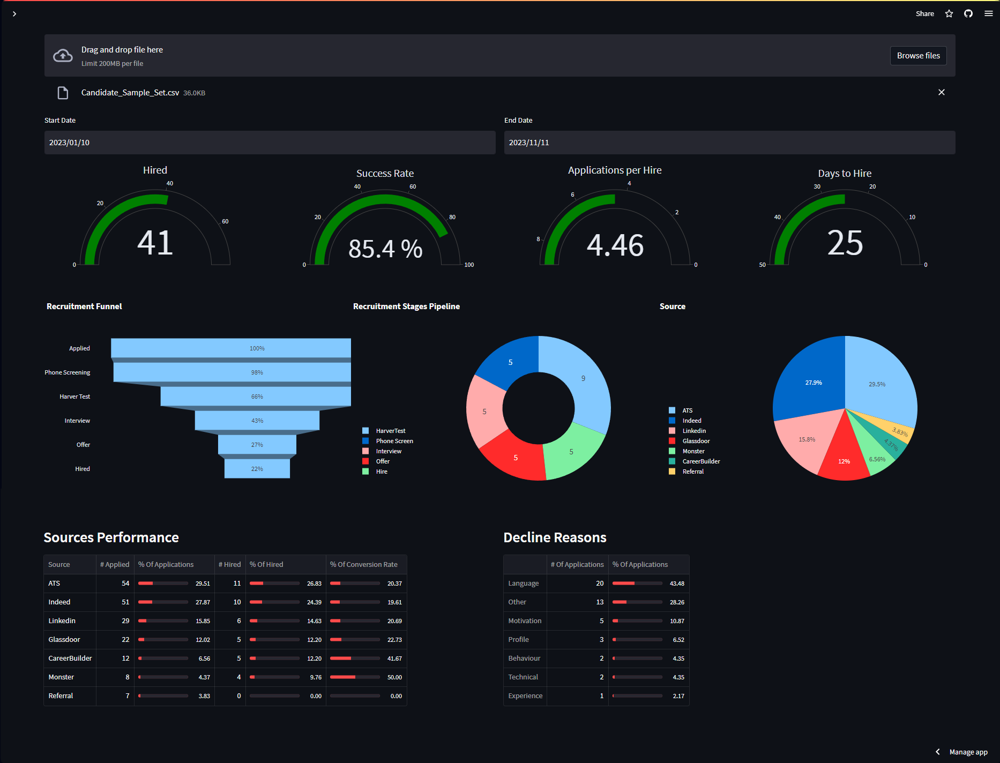
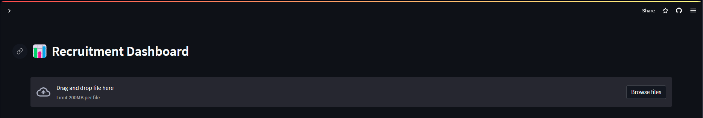
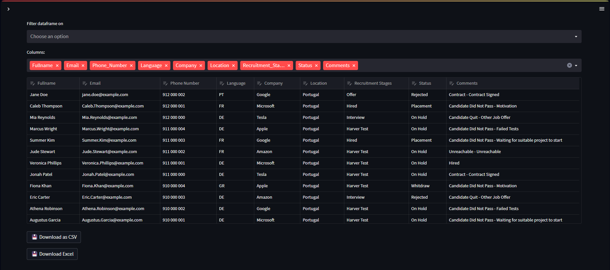
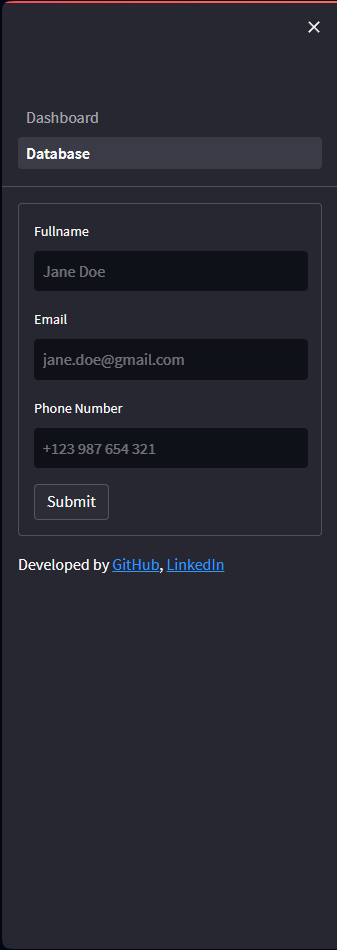

[RUN APP](https://recruitmentdashboard.streamlit.app)
[<kbd>   RUN APP   </kbd>][https://recruitmentdashboard.streamlit.app]

# Recruitment Dashboard

A dynamic dashboard that shows recruitment key performance indicators

## 🚧 Under Development 🚧
[] Add Candidate Form (st.session_state, on_change=True, Callback)

[] Modification_Date Column

[] API Integration

## How to use
### Download [Candidate_Sample_Set](https://github.com/srdobolo/recruitment_dashboard/blob/main/Candidate_Sample_Set.csv) file and upload it in the app section to upload file.

## Index
- <a href="https://github.com/srdobolo/recruitment_dashboard/tree/main#about"> About </a>
- <a href="https://github.com/srdobolo/recruitment_dashboard/tree/main#technology-used">Technology Used </a> 
- <a href="https://github.com/srdobolo/recruitment_dashboard/blob/main/README.md#layout">Layout </a>

## About
An app that offers a free solution for recruiters seeking visual insights into their recruitment KPIs. It features a dynamic dashboard that allows filtering by language, location, gender, or company within a selected time range.

The sidebar menu not only enables filtering of the dashboard but also allows users to navigate to a database dataframe. Within this dataframe, users can select specific columns to view and search for particular values within each row.
An excell template is provided to test the app although any excell file with the columns "Fullname","Phone_Number" and "Email" will work. The columns doesn't have to follow any specific order.

The recommend columns to get all the kpis available in the app are:
Comments, Fullname, Email, Phone_Number, Address, DoB, Gender, Language, Source, Application_Date, Status, Recruitment_Stages, Company, Location, Decline_Reasons, Phone_Screen_Date, Harver_Test_Date, Interview_Date, Offer_Date, Hiring_Date, Payment_Date, Modification_Date

## Technology Used
This app is build with Python 3.7.9 and uses <a href="https://numpy.org">NumPy</a> for mathematical functions, <a href="https://pandas.pydata.org">Pandas</a> to manipulate datafarmes, <a href="https://plotly.com">Plotly</a> for the visualization tools and Streamlit to turn data script into a WebApp and deploy on <a href="https://streamlit.io">Streamlit Cloud Platform </a>.

## Layout

Database

Dashboard Sidebar

Database Sidebar

