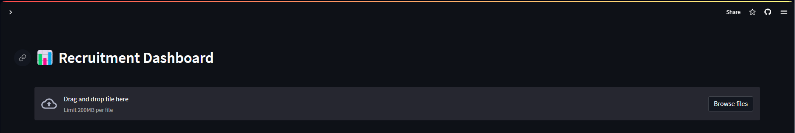

https://recruitmentdashboard.streamlit.app

# Recruitment Dashboard

A dynamic dashboard that shows lead recruitment performance indicators

## 🚧 Under Development 🚧
[] Add Candidate Form

[] Modification_Date Column

[] API Integration

## How to use

Download [Candidate_Sample_set.csv](https://github.com/srdobolo/recruitment_dashboard/blob/main/Candidate_Sample_Set.csv) file and upload it in the app section to upload file.

## Index
- <a href="https://github.com/srdobolo/recruitment_dashboard/tree/main#about"> About </a>
- <a href="https://github.com/srdobolo/recruitment_dashboard/tree/main#technology-used">Technology Used </a> 
- <a href="https://github.com/srdobolo/recruitment_dashboard/blob/main/README.md#layout">Layout </a>

## About
This app is a free solutions to recruiters that want to get visual insights of their recruitment kpis with a dynamic dashboard that can be filtered by various parametters. There is a database menu where you can update your data set with a dataframe that can be filtered and searched for any value.

An excell template is provided to test the app although any excell file with the columns "Fullname","Phone_Number" and "Email" will work. The columns doesn't have to follow any specific order.

The recommend columns to get all the kpis available in the app are:
[Comments,Fullname,Email,Phone_Number,Address,DoB,Gender,Language,Source,Application_Date,Status,Recruitment_Stages,Company,Location,Decline_Reasons,Phone_Screen_Date,Harver_Test_Date,Interview_Date,Offer_Date,Hiring_Date,Payment_Date,Modification_Date]

## Technology Used
This app is build with Python 3.7.9 and uses <a href="https://numpy.org">NumPy</a> for mathematical functions, <a href="https://pandas.pydata.org">Pandas</a> to manipulate datafarmes, <a href="https://plotly.com">Plotly</a> for the visualization tools and Streamlit to turn data script into a WebApp and deploy on <a href="https://streamlit.io">Streamlit Cloud Platform </a>.

## Layout

Dashboard Sidebar

Database

Database Sidebar

