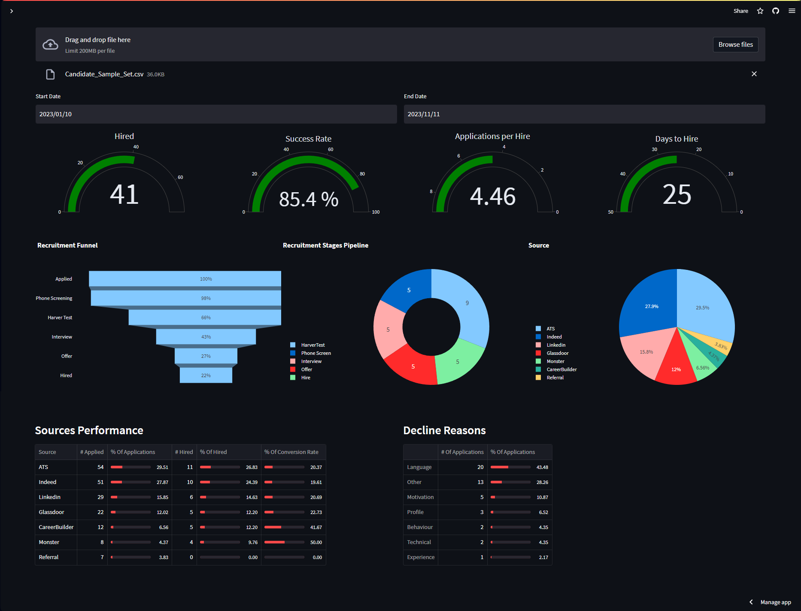
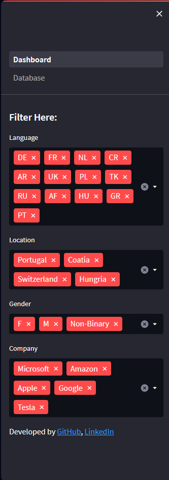
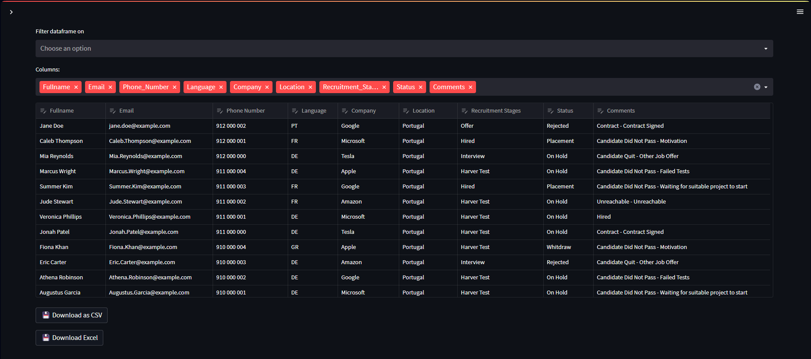
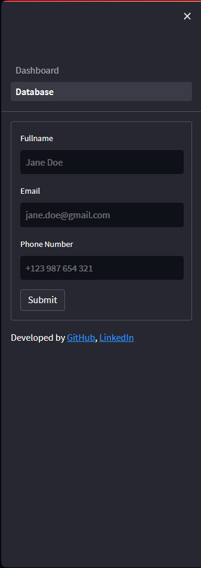

https://recruitmentdashboard.streamlit.app

# Recruitment Dashboard

A dynamic dashboard that shows lead recruitment performance indicators

## Index
- <a href="## About">About </a>
- <a href="## Tech Stack">Technology Used </a> 
- <a href="## Layout">Layout </a>
- <a href="## Concepts Covered">Concepts Covered </a>
- <a href="## KPI's">KPI's </a>
- <a href="# -KPIs">Running Locally </a>
-

## About
This app is a free solutions to freelancer recruiters that want to get visual insights of their recruitment kpis with a dynamic dashboard that can be filtered by various parametters.

## Tech Stack
This app is build with Python 3.7.9 and uses <a href="https://numpy.org">NumPy</a> for mathematical functions, <a href="https://pandas.pydata.org">Pandas</a> to manipulate datafarmes, <a href="https://plotly.com">Plotly</a> for the visualization tools and Streamlit to turn data script into a WebApp and deploy on <a href="https://streamlit.io">Streamlit Cloud Platform </a>.

## Layout

Dashboard Sidebar

Database

Database Sidebar

## Concepts Covered

## KPI's
### All the KPI's shown in the dashboard are in a specific period of time and with the selected language, location, gender or company.
#### Hired
Hired stands for the number of candidates hired.

#### Success Rate
Success Rate is the percentage of hired candidates that turns into an effective placement instead of turning into a whitdrawl or rejection during training for example.

#### Applications Per Hire
Applications Per Hire is the ratio of the total applications divided by the total hired candidates.

#### Days to Hire
Days to Hire is the time taken to hire suitable talent.

#### Recruitment Funnel
The Recruitment Funnel provides a clear understanding of where candidates are in the recruitment process, what stage they need to move to next, and what resources are needed to support them. This can help streamline the recruitment process, improve candidate experience, and ultimately increase the chances of hiring top talent.

#### Recruitment Stages Pipeline

#### Source

#### Source Performance
##### % Of Applications
##### % Of Hired
##### % Of Convertion Rate

#### Decline Reasons
##### % of Applications

## Running Locally
