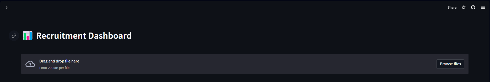
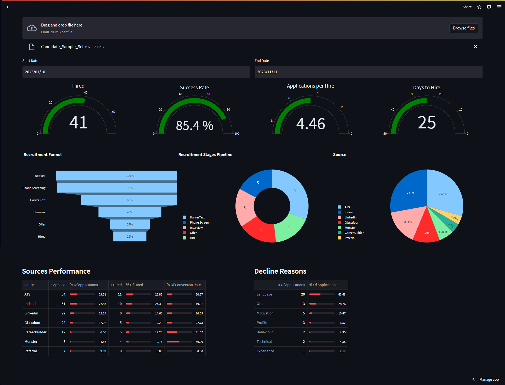
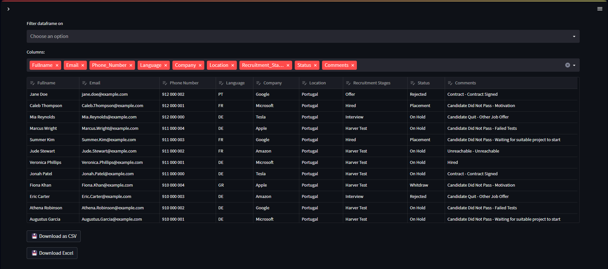
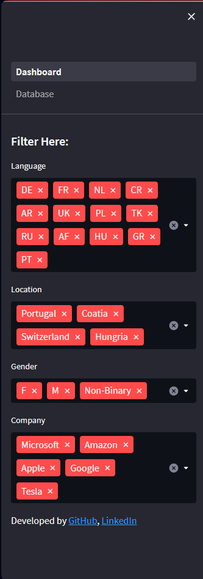
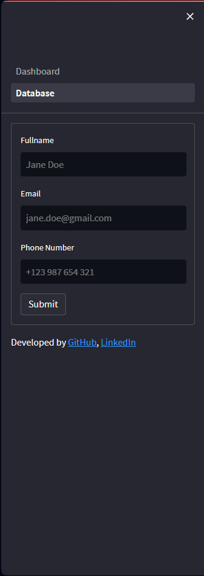

# Live App: [RUN APP](https://recruitmentdashboard.streamlit.app)

A dynamic, interactive dashboard providing real-time recruitment analytics and key performance indicators (KPIs) for recruiters and HR professionals.
It allows users to upload candidate datasets, analyze recruitment metrics, and visualize trends across language, location, gender, company, and time periods.

## Overview

The Recruitment Dashboard is a web application built with Streamlit, Pandas, NumPy, and Plotly, designed to transform recruitment data into actionable insights.
It supports data uploads via CSV files, automatic visualization of key metrics, and flexible filtering options for detailed analysis.

### Key Features

- Interactive Dashboard — Visualize KPIs such as hiring rate, decline rate, time-to-hire, and gender/language diversity.
- Custom Filters — Filter results by company, location, language, or recruitment stage.
- Data Upload — Upload any .csv file with candidate information to generate analytics automatically.
- DataFrame View — Explore and search the uploaded dataset directly from the interface.
- Extensible Design — Modular codebase ready for integration with APIs or databases.

## About

This app provides a free and simple analytical tool for recruiters who need visual insights without complex setup.
It is compatible with any dataset containing at least these columns:

Fullname, Phone_Number, Email — columns can appear in any order.

For full functionality and KPI coverage, the recommended columns are:
Comments, Fullname, Email, Phone_Number, Address, DoB, Gender, Language, Source, Application_Date, Status, Recruitment_Stages, Company, Location, Decline_Reasons, Phone_Screen_Date, Harver_Test_Date, Interview_Date, Offer_Date, Hiring_Date, Payment_Date, Modification_Date.

## How to use

1. Download [Candidate_Sample_Set](https://github.com/srdobolo/recruitment_dashboard/blob/main/Candidate_Sample_Set.csv) file
2. Upload it via the app interface (File Upload section).
3. Explore the Dashboard and Database tabs to filter, analyze, and search your recruitment data.

Example:

## Tech Stack

| Component            | Technology                                                      |
| -------------------- | --------------------------------------------------------------- |
| Programming Language | Python 3.7.9                                                    |
| Data Handling        | [Pandas](https://pandas.pydata.org), [NumPy](https://numpy.org) |
| Visualization        | [Plotly](https://plotly.com)                                    |
| Web Framework        | [Streamlit](https://streamlit.io)                               |
| Deployment           | Streamlit Cloud                                                 |

## Layouts

A dynamic dashboard that shows recruitment key performance indicators

Database

Dashboard Sidebar

Database Sidebar

## Future Enhancements

- Integration with external APIs (ATS or CRM systems).
- Role-based authentication for recruiters and managers.
- Automated daily KPI updates from live data sources.
- Data export and PDF report generation.

## License

This project is released under the MIT License.